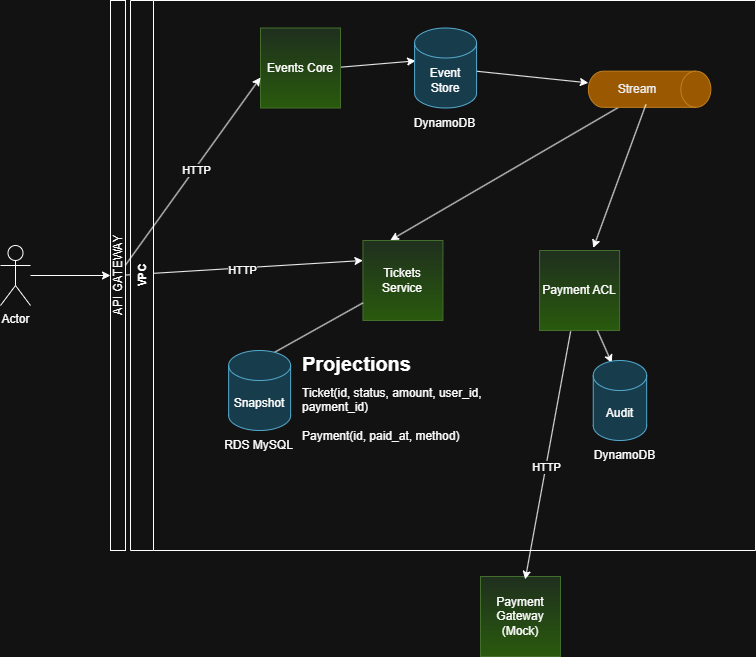

# CQRS Python Project

This is a project to implement CQRS and event sourcing using Python.
####
I'm ignoring stuffs like authentication, horizontal scaling, observability, monitoring.
####
In application level, i'm also ignoring good practices of development, like SOLID and clean architecture.
## System Design

